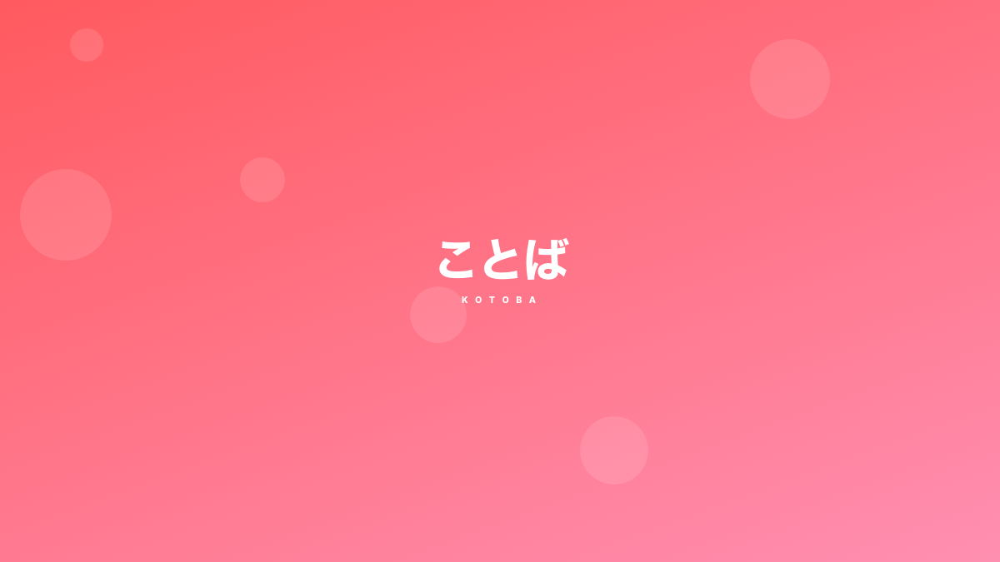

# nihongo

**한국어** | [English](README.en.md)

마스코트와 함께 학습하고 복습 주기를 관리하는 일본어 학습 PWA입니다.

[Demo](https://nihan-go-test.netlify.app/) · [Architecture](docs/ARCHITECTURE.md) · [Project status](docs/PROJECT_STATUS.md)



SM-2 간격 반복 알고리즘으로 복습 시점을 계산하고, 가나·한자·회화·독해와 JLPT 모의고사를 하나의 학습 흐름으로 연결했습니다. Gemini 기반 튜터는 대화 연습과 작문 피드백을 제공하며, 발음 오디오는 IndexedDB에 저장해 네트워크가 불안정한 환경에서도 다시 들을 수 있습니다.

## 학습 흐름

- **학습**: 가나·한자·단어·문법을 단계별로 학습하고 정답 결과를 바로 확인합니다.
- **복습**: 정답 기록을 바탕으로 다음 복습 시점을 계산하고 오답과 약한 영역을 다시 제시합니다.
- **연습**: 회화·독해·JLPT 문제로 학습한 표현을 문맥 안에서 확인합니다.
- **AI 튜터**: 채팅과 작문 첨삭으로 직접 문장을 만들고 피드백을 받습니다.
- **오프라인 재생**: 한 번 내려받은 발음은 브라우저에 보관하고, 외부 TTS를 사용할 수 없으면 브라우저 음성으로 전환합니다.

## 문제에서 검증까지

| 단계 | 내용 |
|---|---|
| 문제 | 학습·복습·회화 기능이 분리되면 사용자가 다음에 무엇을 공부해야 하는지 스스로 판단해야 했습니다. |
| 선택 | 정답 기록으로 복습 시점을 계산하고, 학습한 표현을 회화·독해·시험에서 다시 만나도록 하나의 흐름으로 묶었습니다. |
| 구현 | SM-2 복습 일정, 오답 기록, Gemini 튜터, IndexedDB 음성 캐시를 각각 독립된 모듈로 구성했습니다. |
| 검증 | 학습 상태와 검색·정답 판정 같은 순수 로직을 Vitest로 확인하고, 외부 연동 실패 시에도 기본 학습 흐름이 유지되는지 점검합니다. |
| 회고 | 기능 수를 늘리는 것보다 학습 기록이 다음 행동으로 자연스럽게 이어지게 만드는 일이 더 중요했습니다. |

---

## 스크린샷

| 홈 (마스코트) | 학습 | AI 튜터 채팅 |
|---|---|---|
|  |  |  |

| 오답 피드백 | 음성 모드 | 마스코트 선택 |
|---|---|---|
|  |  |  |

---

## 실행

```bash
npm install
npm run dev        # 개발 서버 (http://localhost:5000)
npm run build      # tsc -b && vite build
npm run lint
npm test           # Vitest
npm run test:ui    # Vitest UI
```

### 환경 변수

```
VITE_GEMINI_API_KEY=      # Google Gemini (AI 채팅 · 작문 첨삭 · 이야기 생성)
VITE_FIREBASE_*=          # Firebase (Auth · Firestore)
VITE_SENTRY_DSN=          # Sentry (미설정 시 자동 no-op)
```

외부 연동을 설정하지 않은 경우에도 기본 학습 기능은 로컬 저장소로 동작합니다. Gemini 키가 없으면 AI 기능 대신 설정 안내를 표시합니다.

---

## 기술 스택

| 영역 | 사용 기술 |
|---|---|
| 프레임워크 | React 19 + Vite 7 |
| 언어 | TypeScript (strict) |
| 스타일 | Tailwind CSS v4 (`@theme` 기반 — `tailwind.config.js` 없음) |
| UI | shadcn/ui (수동 설치) |
| 상태 | Zustand + persist (localStorage) |
| 라우팅 | React Router DOM v7 |
| 애니메이션 | Framer Motion · Lottie |
| 인증 | Firebase Auth (Google · 카카오/네이버 OIDC · 이메일) |
| 데이터 | Firestore (4-doc 분리 동기화) + IndexedDB (`idb`) |
| AI | Google Gemini (`@google/genai`) |
| TTS | Murf.ai (2계층 캐시) + 브라우저 TTS 폴백 |
| 에러 | Sentry + react-error-boundary |
| 배포 | Netlify (`netlify.toml`) / Firebase Hosting |

---

## 주요 기능

| 영역 | 내용 |
|---|---|
| **학습 코어** | SM-2 간격반복(SRS), 오답 노트, 일일 미션, 연속 학습 스트릭, XP/레벨 |
| **콘텐츠** | 단어 사전(N5~N1 레벨별 + 확장 파일 머지), 가나 차트/게임/연습, 한자(단어에서 자동 추출)/연습, 문법, 관용구, 회화(카테고리별) · 독해 · 동요 · 롤플레이 시나리오 |
| **AI** | 튜터 채팅(스트리밍), 작문 첨삭, AI 독해 지문 생성, AI 회화 |
| **시험** | JLPT 모의고사, JLPT 숙련도 · 약점 차트 |
| **개인화** | 마스코트 3종(코타로/유키/소라) + 의상, 테마 7종, 홈 레이아웃 4종, 다크모드 |
| **통계** | 히트맵 캘린더, 주간 캘린더, 업적 배지 |
| **오프라인** | TTS 오디오 IndexedDB 캐시, PWA 설치, 온라인 상태 토스트 |
| **검색** | ⌘K 퀵서치 (단어 + 회화 표현 통합 인덱스, `lib/quickSearch.ts`) |

---

## 프로젝트 구조

```
src/
├── App.tsx              라우터 + 인증 가드
├── store.ts             Zustand (persist, 이어하기 포함)
├── constants.ts         레벨 · XP 규칙
├── lib/
│   ├── firebase.ts      Auth (소셜 + 이메일)
│   ├── firestore.ts     4-doc 분리 동기화 (profile / state / srs / library)
│   ├── srs.ts           SuperMemo-2 알고리즘
│   ├── murf.ts          TTS API — 2계층 캐시 (memory → IndexedDB → API) + prefetch
│   ├── audioCache.ts    TTS 오디오 IndexedDB 영속 캐시 (실패 시 무해 폴백)
│   ├── gemini.ts        Gemini (채팅 · 작문 · 이야기)
│   ├── quickSearch.ts   ⌘K 검색 순수 로직
│   ├── answerMatcher.ts 정답 매칭 (오탈자 허용)
│   ├── missions.ts · notifications.ts · themes.ts · hiraganaToRomaji.ts
│   └── sentry/          도메인별 에러 보고 헬퍼 8종
├── data/                순수 콘텐츠 — words(+n1/n2/ext) · kana · kanji · grammar · idioms
│                        conversations(+ext) · reading(+ext) · songs(+ext)
│                        dialogues · roleplay-scenarios · mascots · achievementBadges
├── hooks/               useTTS · useAIChat
├── components/          ui(shadcn) · chat · conversation · home
│                        ErrorBoundary · CustomToast · ConfirmDialog · 위젯 다수
└── pages/               40여 페이지 (학습 · 사전 · 통계 · 설정 · 회화 · 독해 · 시험 …)
plans/                   작업 계획 문서
docs/                    PROJECT_STATUS.md 등
```

각 디렉토리(`lib/`, `components/`, `hooks/`, `data/`, `pages/`)에 모듈별 `CLAUDE.md`가 있습니다.

---

## 아키텍처

상세는 **[docs/ARCHITECTURE.md](docs/ARCHITECTURE.md)** 참조. 요점만:

1. **콘텐츠는 코드 안의 순수 데이터입니다.** `src/data/*.ts`가 단어·회화·독해·동요를
   포함하고, base와 `-ext` 파일을 병합합니다. 콘텐츠 추가는 데이터 편집으로 완료됩니다.
2. **Firestore는 4-doc으로 분리합니다** (profile / state / srs / library) — 변경 빈도가 다른
   데이터를 분리하여 쓰기 비용과 충돌을 줄입니다.
3. **TTS는 3계층 캐시입니다** — memory → IndexedDB → API. 캐시 실패 시 다음 계층으로 무해하게 폴백합니다.
4. **모든 catch는 사용자 피드백 + Sentry 보고를 함께 처리합니다.** 도메인별 헬퍼 8종이 있고,
   사용자 취소(팝업 닫기 · 비밀번호 오류 · `AbortError`)는 보고를 생략합니다.

---

## 문서

| 문서 | 내용 |
|---|---|
| [docs/ARCHITECTURE.md](docs/ARCHITECTURE.md) | 아키텍처 — 저장소 3층 · SRS · Firestore 4-doc · TTS 캐시 |
| [docs/PROJECT_STATUS.md](docs/PROJECT_STATUS.md) | 기능별 완료 현황 체크리스트 |
| [TODOS.md](TODOS.md) | 남은 작업 |
| [CLAUDE.md](CLAUDE.md) | 작업 규칙 (+ 각 디렉토리에 모듈별 `CLAUDE.md`) |
| [docs/mascot-costume-prompts.md](docs/mascot-costume-prompts.md) | 마스코트 의상 생성 프롬프트 |
| `plans/` | 기능별 작업 계획 — 진행 중 1건 + `completed/` 12건. **로컬 전용**(`.gitignore`)이라 이 레포에는 없다 |

## 프로젝트 룰

`.claude/rules/`에 정리되어 있습니다.

| 파일 | 내용 |
|---|---|
| `error-handling.md` | catch 표준 패턴, 헬퍼 매핑, 보고 생략 케이스 |
| `design-system.md` | 색상 토큰, 테마 7종, 일본어 표시 규칙, Framer Motion 주의 |
| `data-patterns.md` | 회화 ext 분리, Firestore 4-doc, persist 키, 사용자 격리 데이터 |

---

## 개발 참고사항

- **Tailwind v4는 `tailwind.config.js`를 사용하지 않습니다** — `src/index.css`의 `@theme`을 사용합니다.
  shadcn CLI가 v4와 호환되지 않아 컴포넌트는 수동으로 설치했습니다.
- **Framer Motion + Tailwind width**: `flex items-center justify-center` 부모 안의
  `motion.div`에 `w-full` / `max-w-sm` 같은 클래스가 무시될 수 있습니다.
  증상은 **텍스트가 세로로 한 글자씩** 나타나는 것입니다(width가 0에 수렴). 인라인 스타일로 지정합니다.
  ```tsx
  // ❌ <motion.div className="w-full max-w-sm">
  // ✅ <motion.div style={{ width: '100%', maxWidth: '24rem' }}>
  ```
- 모든 Dialog에는 접근성을 위해 `DialogTitle`이 필수입니다.

---

## 라이선스

**Source-available — 오픈소스가 아닙니다.** 코드를 읽을 수 있도록 공개했을 뿐,
사용 권한을 부여하지 않습니다. 다른 프로젝트에 사용하거나 재배포·상업적 이용을
하려면 사전 서면 허락이 필요합니다. 전문은 [LICENSE](LICENSE), 한국어 안내는 [LICENSE.ko.md](LICENSE.ko.md) 참조합니다.
